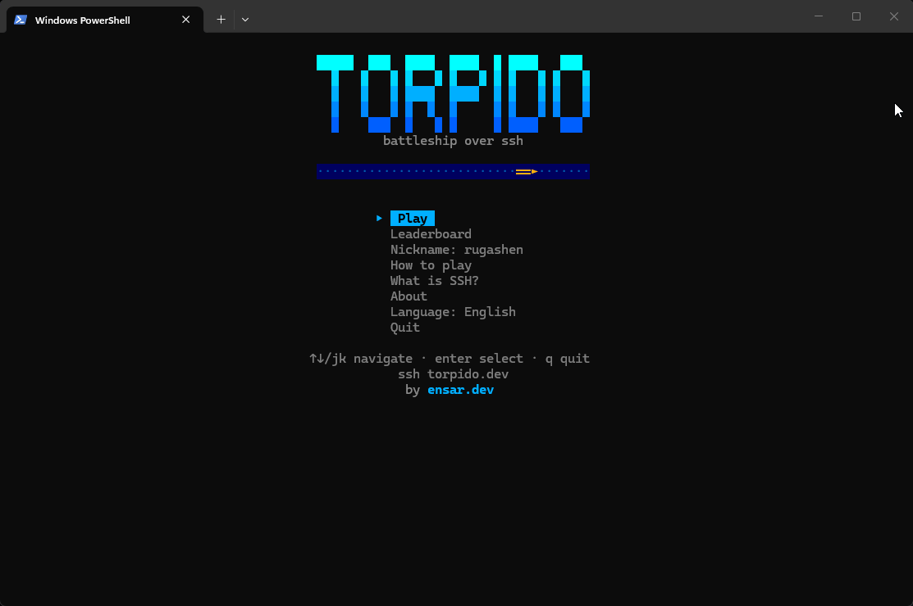

<div align="center">

# 🚢 torpido

### Battleship you play by typing `ssh torpido.dev`.



[](https://go.dev)
[](LICENSE)
[](https://github.com/charmbracelet/bubbletea)
&nbsp;·&nbsp;
[**torpido.dev**](https://torpido.dev)

</div>

No download. No account. No browser. Open a terminal, run one command, and you land
straight in a lobby — bots on tap, or a room code to send a friend.

```
ssh torpido.dev
```

Your SSH key is your identity, so your record and nickname come back with you every
time. Nothing to sign up for, nothing to remember.

## Playing

- **A bot** to warm up — three of them, always around.
- **A friend** — create a room, send the four-letter code, settle it 1v1.
- **Quick match** — get thrown at whoever's online.

```
placing   arrows / hjkl to move   ·  r to rotate  ·  enter to drop
firing    arrows / hjkl to aim    ·  enter to fire
          q steps back a screen   ·  ctrl+c disconnects
```

## What's inside

- **Real 1v1 over SSH** — invite codes, quick match, password rooms, rematches
- **Three bots** — Rookie, Admiral, and the Sea Wolf, who hunts by probability and does not miss
- **A leaderboard that follows your key** — top ten and your own rank, no signup
- **Terminal, but with a pulse** — waves that roll, hits that explode, a battle log that scrolls
- **English & Türkçe**

## How it's built

One Go binary that speaks SSH. [Wish](https://github.com/charmbracelet/wish) hands each
incoming session to a [Bubble Tea](https://github.com/charmbracelet/bubbletea) program, so
the exact same code drives your terminal and every opponent's. The connection *is* the
game — no client, no web app, nothing to install.

## Run your own

```sh
go install github.com/ensardev/ssh-torpido@latest
ssh-torpido serve            # listens on :2222 — set TORPIDO_ADDR=:22 for the real thing
```

[`deploy/`](deploy/) has a `systemd` unit and a one-command deploy script, plus notes on
putting the game on port 22 so `ssh yourdomain` just works.

## Why?

No grand reason. It was a fun thing to build and it's a fun thing to lose at. That's the
whole pitch.

---

MIT · made by [ensar.dev](https://ensar.dev)
